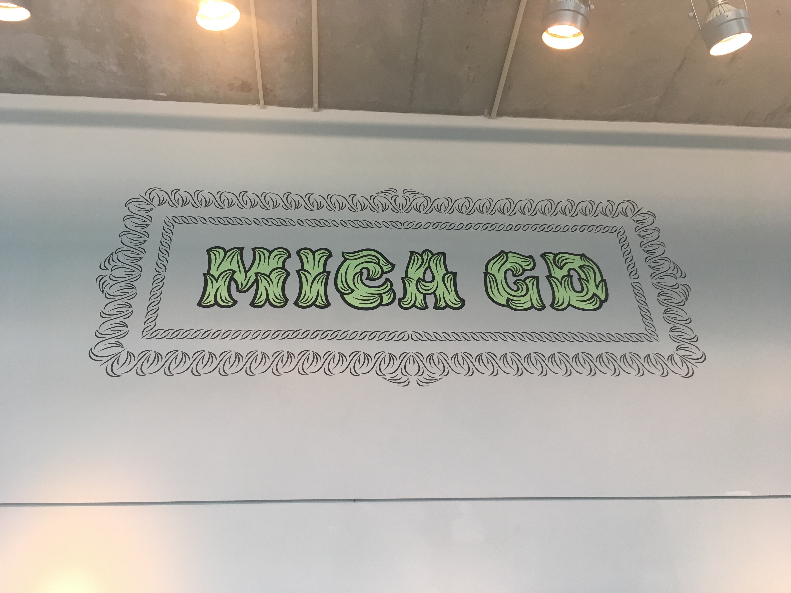
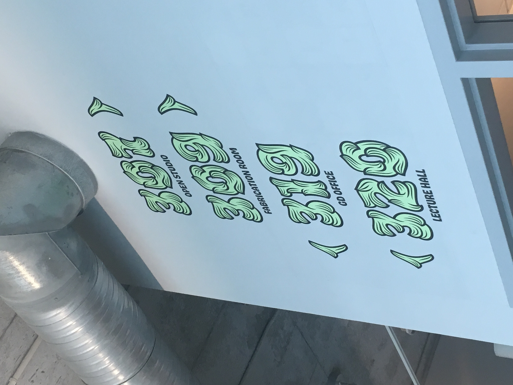
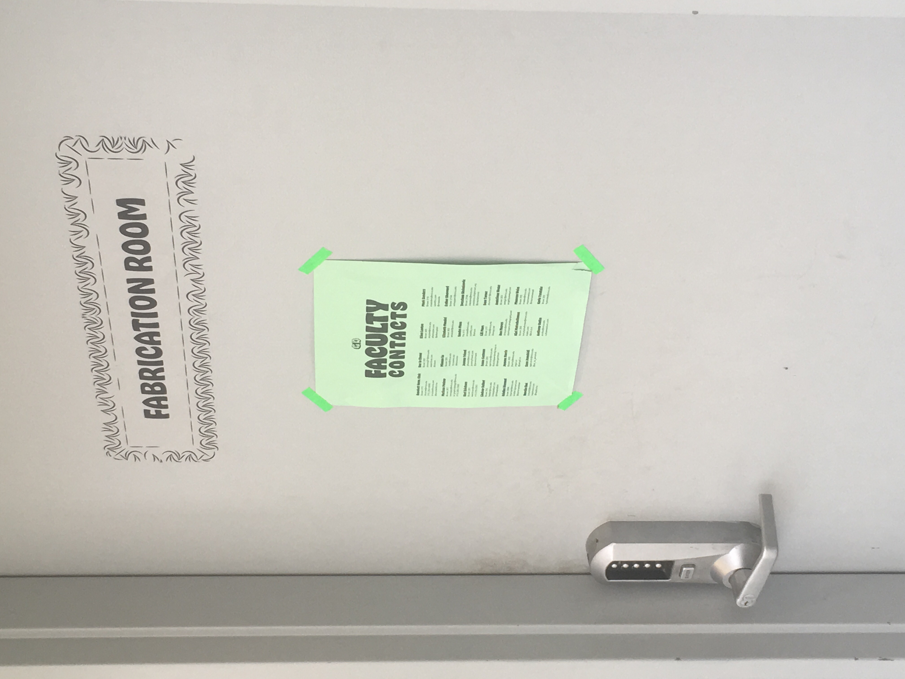
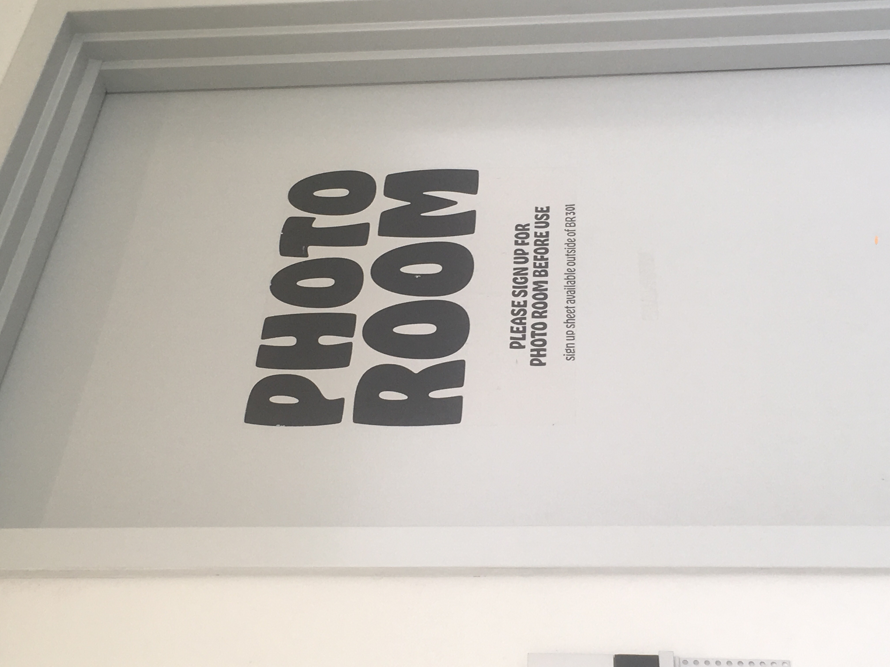
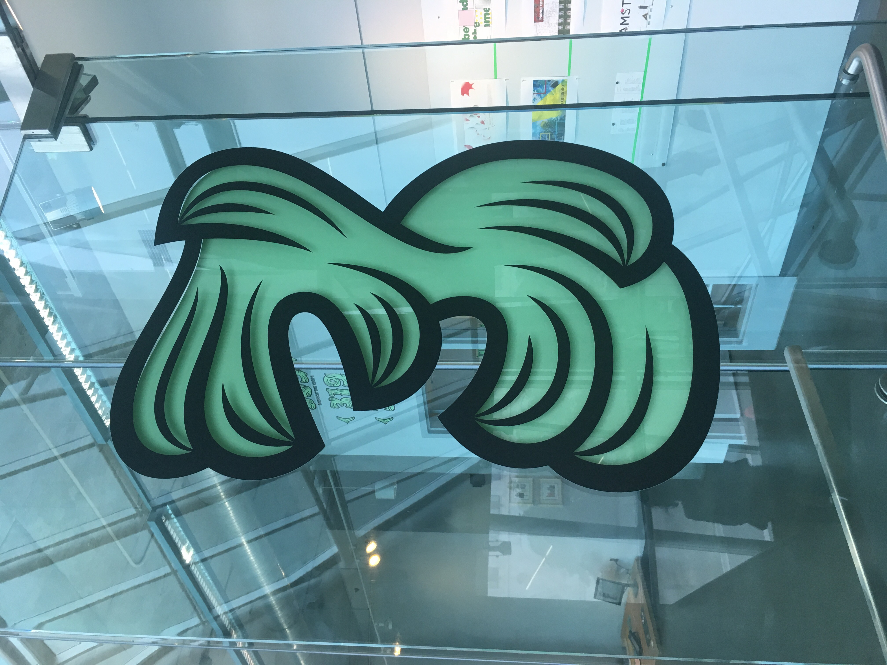

# MICA Graphic Design Department Identity

Brand identities rarely have sustainability in mind. They are meant to provide a cohesive "image" to corporate entities and be able to hold this image for a certain number of years until it goes out of fashion, usually to be replaced with another trendy direction. MICA's Graphic Design Department often switches up their image every 2/3 years. Our department's image is very unsustainable, but that's part of the existing "brand" the department assigned itself: a brand that embraces change and subversion, be it for better or worse. If designed well, a brand can last as long as the entity exists (which could be for decades to centuries) -- or the ephemerality can be embraced.

As designers, we often have little control and are subservient to our client's wishes. However, with enough conviction, we can use this opportunity to educate. This term I was currently working on rebranding the MICA graphic design department. Fortunately, I was given free range to do anything, provided I create signage and print collateral and connect the identity to the department's ever-changing image. By creating this identity, I hope to bring to light that sustainable measures in designing a brand can exist and be substitutes as healthy alternatives to the status quo (alternatives to vinyl, etc.).

My first course of action is to set one, large restriction: no vinyl whatsoever. Vinyl contains a chemical called PVC (Polyvinyl chloride), which when discarded, releases mercury, lead, and cadmium, contaminating soil and water sources. PVC is not degradable and retains its form for centuries. 

Vinyl is in every way convenient as it is toxic. Vinyl can be used for good, especially as permanent signage (since it sticks so well to most anything and degrades so slowly), but we often use vinyl lettering for exhibitions lasting no more than a month or so. Considering that the MICA GD identity is mostly signage and print-based, figuring out how to redirect signage into other mediums was a crucial first step.

# Intro: 2017–2019 
The previous identity was based on the revitalization of Hobo, a typeface that over the years became an often maligned typeface that slowly degraded in credit and appreciation within designers. This is mostly due to the change of tastes in recent years from one-hit/display typefaces to more malleable ones. James Edmondson, typeface designer and previous deisgner of the department identity, made a new typeface called "Hobeaux" to challenge and revitalize and modernize the "glory" of the Hobo's unnatural but unique curves.

As you can tell from these photos, this identity didn't reconsider vinyl; in fact, it might've embraced it too much to the point of overindulgence. The accessory of the added borders around all signage added more to the identity of Hobeaux, but is too superfluous. Don't think of Edmondson's design as inherently terrible--far from it. But it does consider the aesthetic more so than the underlying consequences of designing something as complex and rendered as his typeface and identity.

# Consideration: 2019–??? 

In order for the brand to connect to the larger scope of the school, but also play on the idea that the department is subversive, I took MICA’s iconic “Giza” typeface and took apart the letters. I then reconstructed the pieces into an entirely new typeface, playing into the idea of reusing and repurposing digital materials. By doing this, not only does this create interesting opportunities for modular type, but also give form to pattern-making, iconography and wayfinding (arrows). Large stencils were fashioned so the lettering can be used as a form of permanent signage for the floor.

This new typeface is called "Maker Giza," playying on the new role of "designer as maker." The notion of a "maker" is rooted in traditional crafts and practices, which is what "Maker Giza" aims to do through its subversion of signage and typographic treatment. 

Figuring out the signage naturally led into creating a typeface in order to maintain consistency for print deliverables.  Choosing the body text came down to convenience, conservation of energy and accessibility. By choosing the default typeface native to InDesign and Illustrator, typefaces like “Minion Pro” and “Myriad Pro” can be used by anyone, anywhere with Creative Cloud. Not only do these 2 typefaces (especially “Minion Pro”) offer a wide number of weights, they also compliment the modular “Maker Giza” typeface with their humanistic undertones. 

It might not seem as though choosing typefaces is something to be "sustainable" about, but we often forget that saving time is just as sustainable as conserving materials and energy. Sustainability doesn't necessarily equate to resources but rather sustainable design practices and productions. Our main resource is time, and if there is a way to save/conserve time, then its sustainable. Typeface choice is mainly arbitrary other than for aesthetic differences. Removing this process would clear time to conserve energy for more important tasks (or just to finally relax!).

# Real-World Challenges and Clients

Considering the real-world implications of making this project and making it a reality, this identity wouldn't have been possible without both support and criticism from the clients. My clients, Brockett Horne, and assistants Melissa Malguy and Karl Ericksen, 
A series of progress presentations were given between early April onto the final day, May 3. Alongside my 
