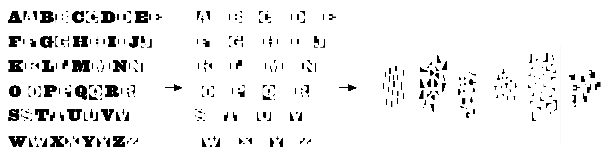
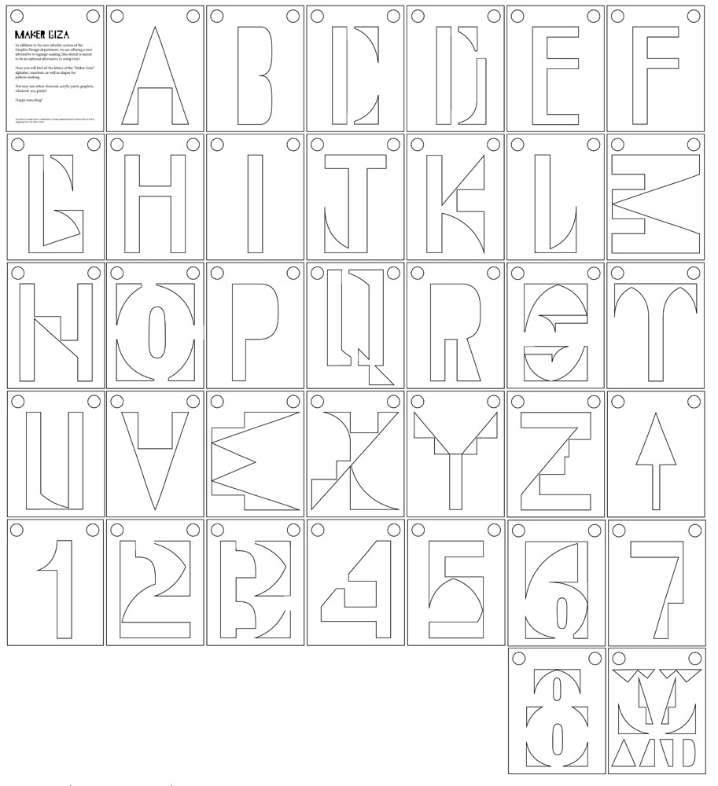
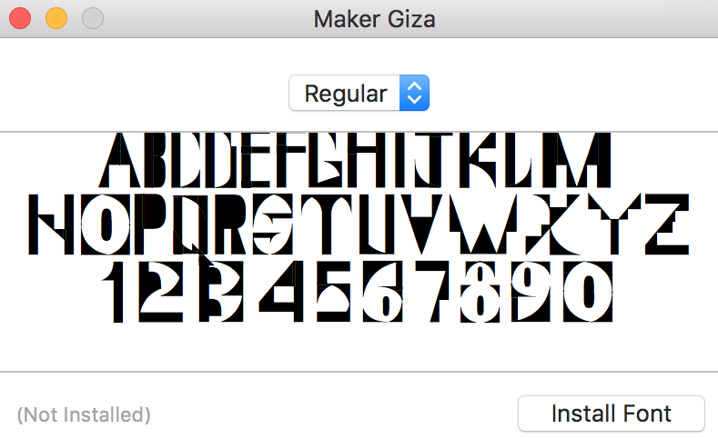

# MICA Graphic Design Department Identity

Brand identities rarely have sustainability in mind. They are meant to provide a cohesive "image" to corporate entities and be able to hold this image for a certain number of years until it goes out of fashion or, if designed well, will last as long as the entity exists (which could be for decades to centuries). 

However, MICA's Graphic Design Department often switches up their image every 2/3 years. Our department is very unsustainable, but that's part of the existing "brand" the department assigned itself: a brand that embraces change and diversity, be ir for better or worse. 

As designers, we often have little control and are subsurviant to our client's wishes. However, with enough conviction, we can use this opportunity to educate. Fortunately, I was given free range to do anything, provided I create signage and print collateral and connect the identity to the department's ever-changing . By creating this identity, I hope to bring to light that sustainable measures in design can exist and substitute as healthy alternatives.

My first course of action is to set one, large restriction: to not use vinyl stickers whatsoever. Vinyl contains a chemical called PVC (Polyvinyl chloride), which when discarded, releases mercury, lead, and cadium, contaminating soil and water sources. PVC is not degradable and will retain their form for centuries. 

Vinyl is in every way convenient as it is toxic. Vinyl can be used for good, especially as permenant signage, but we often use them for exhibitions lasting no more than a month or so. Considering that this identity is mostly signage and print-based, figuring out how to redirect signage into other mediums is a crucial first step.

This first step is to create a logo/type lockup that would be put up right above the entrance of the department floor. By playing on the subversive and rule-breaking identity 

In order for the brand to connect to the larger scope of the school, but also play on the idea that the department is subversive and rule-breaking, I took one of MICA’s iconic “Giza” typeface and decided to take apart the letters and reconstruct it into an entirely new typeface, playing into the idea of reusing and repurposing digital materials. By doing this, not only does this create interesting opportunities for modular type, but also give form to pattern-making, iconography and wayfinding (arrows). A large stencil would be fashioned so it can be used as a form of permanent signage for the floor but also as a substitute for exhibition signage in Bronze Gallery. 

But is this truly useful? I was starting to doubt whether stencils would truly work 

Figuring out the signage naturally led into creating a typeface in order to have consistency. 
Choosing the body text came down to convenience, conservation of energy and accessibility. By choosing the default typeface native to InDesign and Illustrator, typefaces like “Minion Pro” and “Myriad Pro” can be used by anyone, anywhere. Not only do these 2 typefaces (especially “Minion Pro”) offer a wide number of weights, it also compliments the modular “Maker Giza” typeface. 

It might not seem as though choosing typefaces is something to be "sustainable" about, but the truth of the matter is that a main resource we unaccount for is time.  

Our main resource is time: if there is a way to save/conserve time, then its sustainable. Sustainability doesn't necessarily equate to resources
from a produciton standpoint 
Typeface choice is mainly arbitrary other than aesthetic differences. Removing this process 

letters create templates for letterforms but d

"Maker Giza" is named for the role of designer as maker. The notion of a "maker" is rooted in traditional crafts and practices, which is what "Maker Giza" aims to do through its subversion of signage and typographic treatment. 
