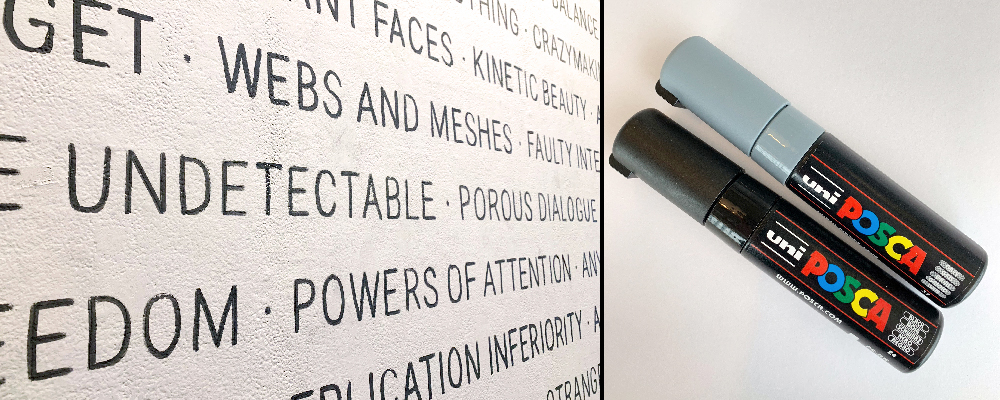

# A Student's Dilemma

A few months ago, I signed up for a sustainable graphic design course because I wanted to learn more about how the discipline impacts the environment. But the class made me rethink more than just my approach to graphic design. I discovered zero-waste lifestyle blogs ([1](http://trashisfortossers.com/),[2](https://www.goingzerowaste.com/),[3](https://www.youtube.com/watch?v=BxKfpt70rLI)), several videos on YouTube ([1](https://www.youtube.com/watch?v=EAmmUIEsN9A),[2](https://www.youtube.com/watch?v=FpHgbRn11kk),[3](https://www.youtube.com/watch?v=6RlxySFrkIM),[4](https://www.youtube.com/watch?v=Cg3OA1s8-SI&list=UUJsSEDFFnMFvW9JWU6XUn0Q)) showcasing innovative approaches to sustainable living, and realized that personal consumption and waste also played an important role in my design practice. The waste I was generating in my personal life far outweighed the negative impacts of my current design practice at MICA and likely feed into my unsustainable approach to graphic design. I decided I needed to think about things more holistically. If I developed a sustainable design practice but didn't do anything to improve my lifestyle I feared that shortly after the course ended, I'd simply revert back to old habits and none of these sustainable values would stick. It also seems very unlikely that I'd be a good champion for sustainable graphic design in my professional practice moving forward, where clients and project constraints often create serious barriers to a sustainability, if I'm not willing to put in the effort to try and live sustainably at home. So, for the classes final project, I decided to try and drastically reduce my waste (inspired by zero-waste lifestyle blogs) and document the experience. Along the way, I also tried applying sustainability to aspects of my thesis project. The following is a reflection on that experience. 

## RESEARCH

The biggest resource for our class was the Sustainability reader. It contained several (#) essays on sustainable design along with a helpful collection of list, charts, and manifestos that created an overview for how we could approach sustainability in our own practice. In addition to that, I also did a good amount of my own research and found a lot of inspiring blogs and YouTube videos that helped me think about how sustainability could influence my personal life. Zero Waste bloggers were particularly helpful throughout this project because they provided so many simple alternatives that help me cut back on or completely avoid sending anything to a landfill. I found this [zero waste outline](http://trashisfortossers.com/a-beginners-guide-to-zero-waste-living-ps-it-doesnt-happen-overnight/) and I'd recommend it to anyone looking to live a more sustainable lifestyle. 

### 1. Establish your "why"

I'm trying to develop a lifestyle and if my everyday actions are more in line with sustainability, I believe it will it naturally start to influence my design practice.

### 2. Where did most of my waste come from in the last two months?

It came from the kitchen! Paper towels, plastic wrappers, food packaging from the store or delivery services, and food scraps make up most of the trash each week. In addition to that, there are some small items from the bathroom and cat litter.

### 3. Prioritize

1. Food/Kitchen Related Waste
2. Design Related Waste
3. Cleaning/House Waste

### 4. Replace Items as they Run Out & Properly recycle / compost items

This step is important! I wanted to cut back on my trash production over the month, but there were still plenty of unsustainable products in my house. So, do I just throw all off that away, so I can start off with a clean slate? No! Since I already bought the paper towels, and the tooth brush, and the packaged cleaning supplies, etc. I just need to use them. It doesn't make sense to get so wrapped up in only using reusable products that you just throw away everything in the house that doesn't fit into your long-term plan. But with this in mind, it's important to highlight that I produced a fair amount of trash compared to the zero-waste lifestyles I was inspired by. But that's OK, it's a process and it's something to work towards overtime. I'm about to run out of a handful of products that I plan on replacing with sustainable alternatives and I'll keep getting better over time. Don't expect to jump to practically zero-waste overnight. 

Here are some other resources that helped me throughout the month. 

[Baltimore recycling information](https://publicworks.baltimorecity.gov/recycling-services)

[MICA Sustainability Office](https://www.mica.edu/offices-divisions/office-of-sustainability/)

[Mom's Organic Market](https://momsorganicmarket.com/)

## GRAPHIC DESIGN

1. Web Design 

Inspired by this solar powered website and the principles they laid out I tried designing a website for my thesis project using as little as code as possible with no unnecessary content. The site works, but in it's current iteration, it feels really undesigned and I might need to keep playing with it. Currently it feels more like I didn't do anything, as opposed to intentionally designing something to use less energy. There is nothing about the design or function of the site that helps users know that the site is trying to be sustainable. 

Is this really a problem? If the site is too simple and no one winds up using it, is it a failure? I would argue yes. The goal of the project isn't to be sustainable. The project has its own objectives and achieving them in a sustainable fashion is an additional challenge. There needs to be a balance and I'd imagine that this will be different for every project. On the other hand, you could make the argument that if there isn't a way to make the project work sustainably, then you should just not do the project at all. This approach also varies greatly depending on how hard core you want to be about defining sustainability. 

2. Thesis Exhibition

For my exhibition, I avoided vinyl on the wall by using a paint marker and projector to get a large amount of typography on the wall. This took about four hours to get done, it was easier than actually dealing with vinyl and it gave the wall a more unique appearance. This felt a bit risky in the moment, because I had never used this method before and if it hadn't worked it would have put me in a serious time-crunch. I did a few test in advanced and planned out my approach and luckily it all worked out. In the long run, this is a small change and it probably won't work for everyone's exhibition needs, but it was a nice example of sustainability can push your practice in new directions.  

## SUMMARY

I wanted this class to have a lasting effect on my practice but as it comes to a close, I'm facing the fact that sustainability isn't a destination you reach after a few months of work. It's a daily challenge to push back against deeply ingrained habits that champion convenience and comfort, and I'd be lying if I told you there were never days when old habits got the best of me throughout this project. 

My hope is that by sharing this information it might encourage students to take an honest look at their trash and think more about how they can live sustainably in their personal life as well as in their design practice.
