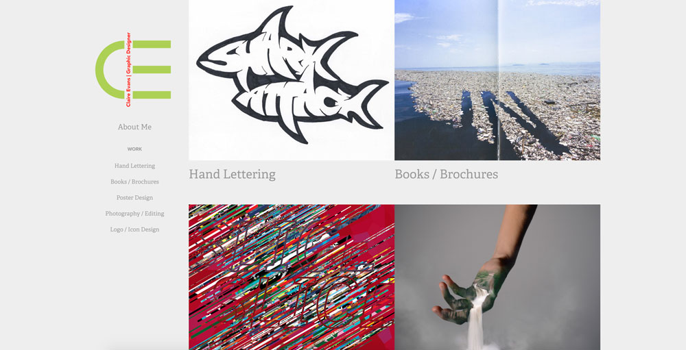
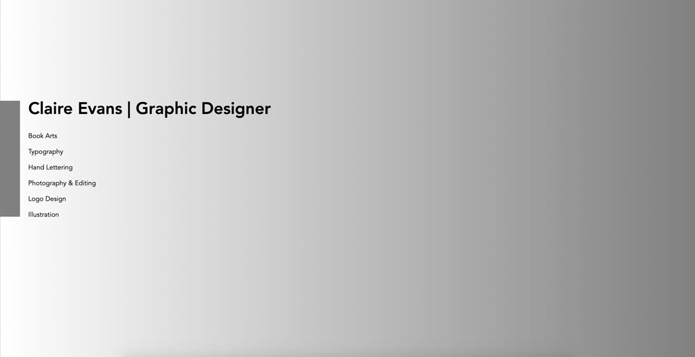

#Sustainable Portfolio Website

I started making my own website on Adobe's portfolio feature, thankful that I would not have to spend more money on a domain and server account. However, I know very little about the ways of the web, the way that you are supposed to optimize images, and the way the servers have to send information back and forth constantly in order to load content on a site. So I embraced my large images, ability to put as much content as I would want on the site, and the amazing animation features that work throughout the site. 

 
Having an online portfolio as an artist nowadays is a given. But think of all of those artists that have their own websites that are jammed packed with large images and content just like mine; it ends up being a lot of energy and space on internet servers. If every artist were carefully consider their footprint on the web, we might end up saving a lot of energy in the end. 
 
My goal was to create a more sustainable, less energy consuming website, and in order to insure it would in fact be more sustainable, I had to code it myself.  Content needed to go down. For starters, I had to think more philosophically about the point of the portfolio website. What do I absolutely need to include? What can I take out? Who are my viewers, what are they looking for, and what do they need to see? The people looking at my website are people that I am specifically applying to for an internship. They want to see my work and my abilities. They are people not trying to find someone to commission which is why I got rid of a contact page and about me page. I can explain the "about me" section in my cover letter to them or in an interview with them. It was not necessary so I replaced it with a small list of my skills—the necessary barebones. And down the line if I feel that I need it, I will add it in. 

 
Additionally I wanted to create a single scroll page because this would eliminate the need to click from page to page within a site, saving the servers from having to send information back and forth, over and over again. It would take one load to view the entirety of my site.  The element that takes the most energy to load are the pictures on the site. In my previous portfolio I did not understand that it mattered what the file size of the images were, so I optimized my images to get them all below (except for a few and the GIF files) 100KB.  The time it took to load my site decreased significantly. I also paired down the number of images to my most successful pieces. Although I am very proud of my drawings that I created, because they do not serve much in reference to building a graphic design portfolio, I removed them from the site. 

 
Before I began coding, I thought about the fact that when I code I often fiddle around, change stuff, and keep trying different scenarios of code through trial and error. This process in of itself uses energy and time that did not need to be wasted. I instead planned my code visually first on paper, then wrote down the code I would need to write in the HTML and CSS. When I opened visual studio code, all I had to do was copy it in. I also thought of ways I could use the least lines of code. All the elements were treated as a body instead of individually. I left many of the elements in the places HTML naturally places them, and used simple coding to make it visually unique. I did not link any fonts to the code, sticking to the default Sans-Serif font, and I used only two colors. 

 
I actually found it challenging to find examples of low-energy sites, and if they were supposedly low-energy there was no indication or explanation of them being low-energy. I real inspiration was Kris De Decker's unattainable (at this stage) solar powered website, and a few single scroll online portfolio's that I found.

* https://www.dbworks.pro/ 
* http://ovefelt.se/
* http://www.tvrdek.cz/en 

When I inspected both of my sites, I could actually see the impact that my new site had on decreasing energy. To experience my new coded portfolio site, it took one load of 141ms (which is a really low amount). In order to load my previous website, it took 700-900ms per click, and there are seven different pages to load to view all of the content. Though this project may seem minutely impactful in the grand scheme of sustainability, if everyone were take this approach, it would make a large scale difference.

