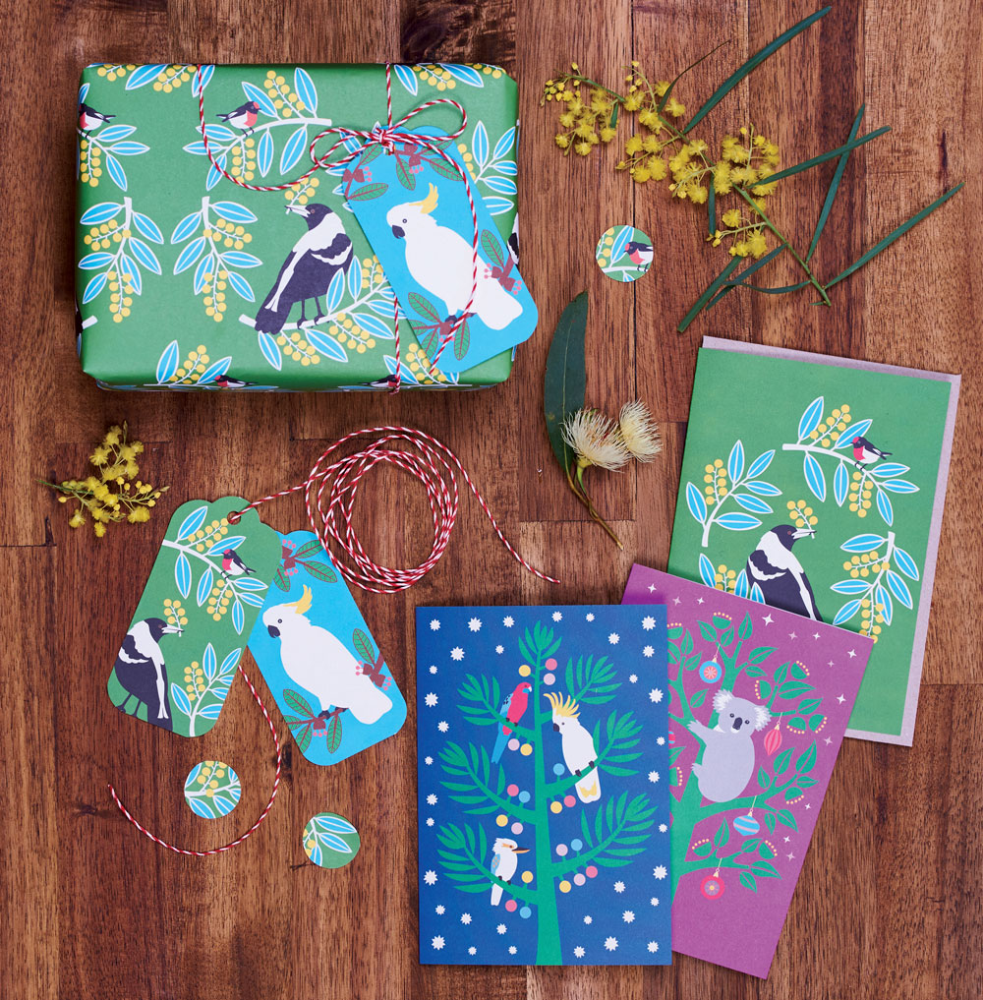
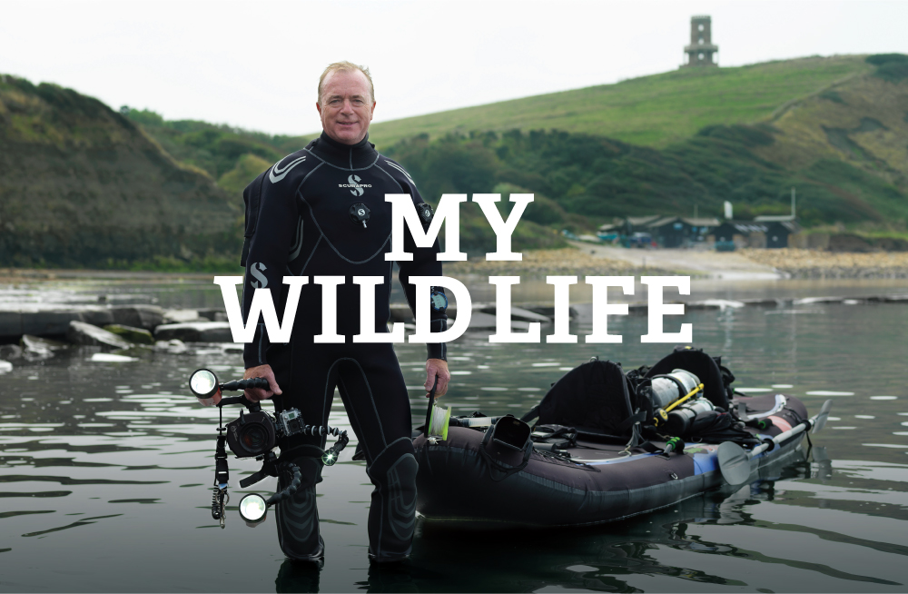
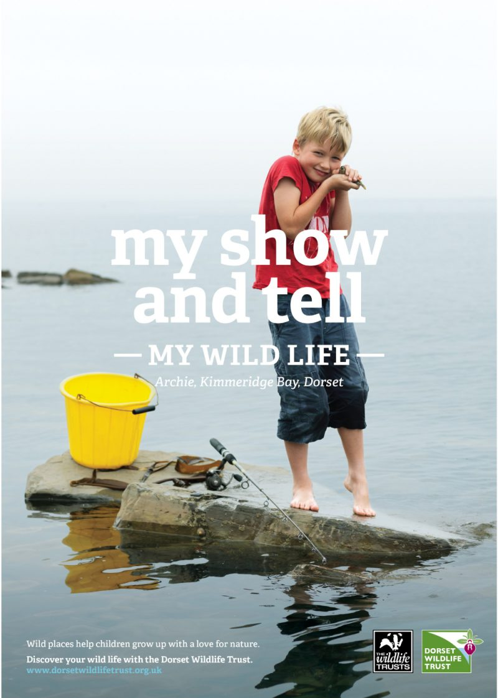
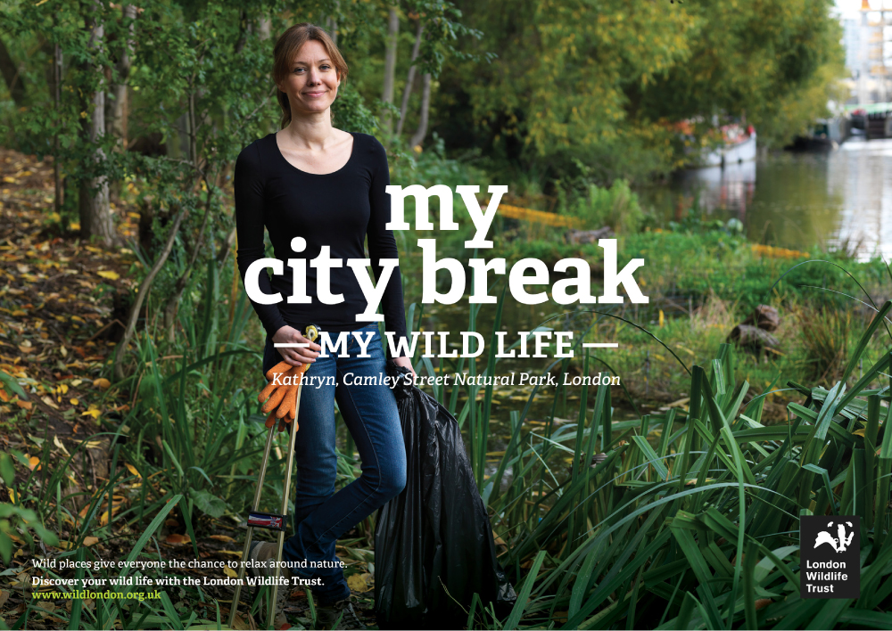
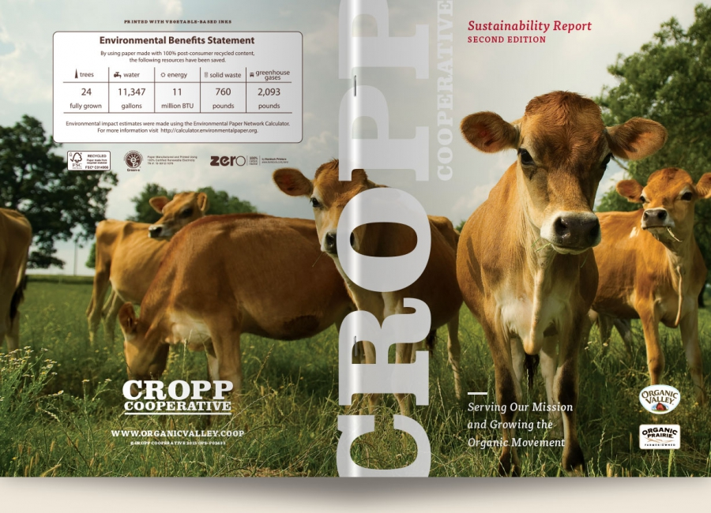
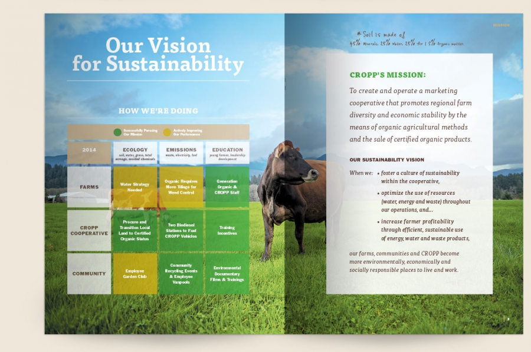
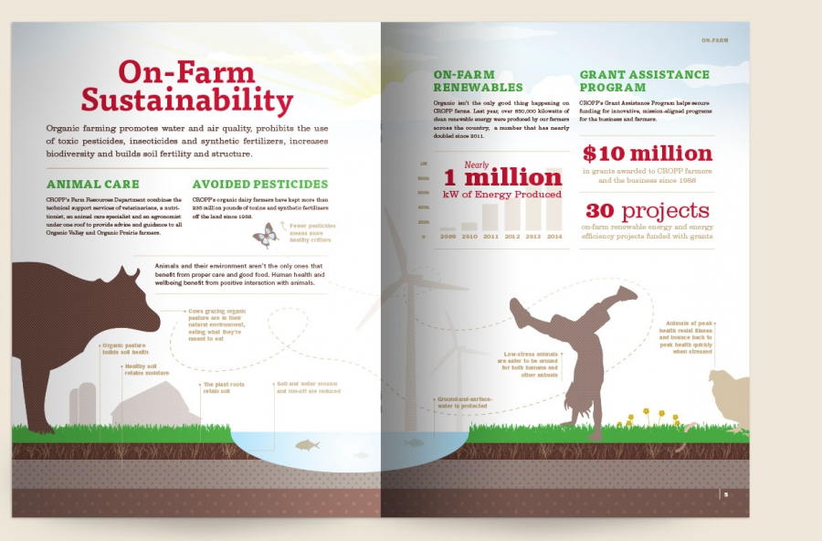
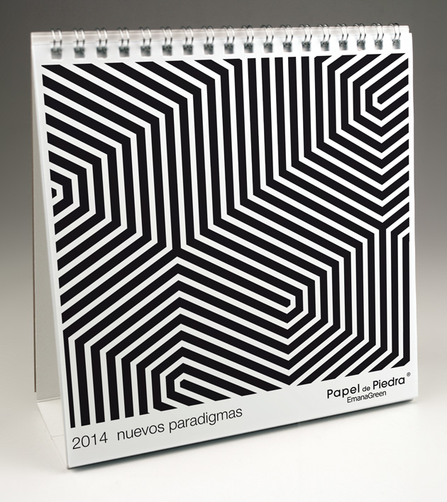
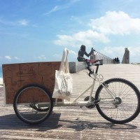

#Designers Working Towards Sustainable Practices

## Renourish

###Who They Are
An Australia based non-profit organization that advocated for more sustainable graphic design practices. They provide tools such as a project calculator which allows you to input all the your project specifications and calculates waste created and then informs ways in which you can reduce your waste for your project. 
###What They Do Differently
Published a book called Design to Renourish, written by Eric Benson and Yvette Perullo. It is a book written for graphic designers that, "helps to integrate sustainbility into their workflow through design process called systems thinking. This process asks the graphic designer to approach a design problem by being more informed and aware of and influenced by the impacts that materials and vendor choices have on one another, the planet, and consequently on us" (https://re-nourish.org/design-to-renourish/).

###Project Example

Renourish designed sustainable greeting cards that would benefit the non-profit organization, Trees for Life, in Australia that works to plant native trees. For this project they used 100% post-consumer recycled paper for both the cards and the envelopes. The envelopes were also unbleached. They used vegetable based inks, used digital to plate printing and worked to decrease water consumption. They designed the packaging to show the card designs through a cut out window, eliminating the use of plastic. They worked have the project carbon neutral by offsetting the amount of greenhouse gas emissions produced with Green power. Through their efforts, they were able to donate enough money to Trees for Life to plant over 40,000 trees. 

## Futerra
###Who They Are
Futerra is a sustainability consultancy agency working simultaneously as a creative agency.  They work with clients that are promoting sustainably positive change. They started in the UK and have branched out to locations in Stockholm, New York, and Mexico.
###What They Do Differently
They are majority owned and led by a group of women, and they are one the United Kingdom's first B-Corporation, which essentially means an ethical business that, "commit to hitting social and environmental goals, alongside financial ones" (https://www.businessinsider.com/b-corporation-uk-2015-9
http://futerra.alchemy.digital/about/)

They created a "Selling Sustainability" open-source guide for businesses that explains the importance of moving towards sustainability,  what the challenges are in branding sustainability, and how you can overcome them. They even have a section on how to avoid "Greenwashing," or over-glamorizing their "eco-friendly" product that may only have one sustainable attribute such as using less ink on the packaging and calling yourself sustainable. 

###Project Example
The Wildlife Trusts: This charity, The Wildlife Trusts, has 800,000 members dedicated to save the existing nature in the United Kingdom. They decided to hold a campaign to make more people in the UK understand the importance and value of nature in the nation. The Futerra design group created a campaign website, short-films, workshops, and print and social media designs. They created a series of images of people a part of the Wildlife trust who regularly enjoy nature and the activities they do in nature, emphasizing the importance of nature in their lives. The slogan used throughout was "my wildlife," and filling in the wildlife with catchphrases related to their activity. They received 200,000 views on their videos, 27,000 new members that will help to contribute more funds, and 325,000 sessions on their website. This campaign helped to initiate more care and awareness on the nature that is left in their nation, and strived to change people's attitudes towards it. I am unsure if their design practices in the process strived to make sustainable choices such as using nontoxic inks; however, this work and the rest of their work campaigns people for more environmental sustainability awareness and understanding in people's everyday lives. 

## Modern Species LLC.
###Who They Are
A branding design group that works with companies who have environmental missions to push their clients to do better for the environment, economy, and society while also creating unique and custom brands. They accentuate that they are not Utopians, and instead embrace the practical nature of the world we live in and realize brand identity and certain market standards are important.  Their website is also beautifully designed. 

###What They Do Differently
They work to be a sustainable company not just for their clients, but also in their work space. They use low-VOC furniture, are wind-powered, compost and recylce, as well as accentuate a healthy working experience for their employers (health insurance, flexible schedule, paid leave, and fair wages)

They create sustainability reports for their clients, allowing there to be transparency for consumers, and giving the companies a tangible understanding and feeling of change. They also acknowledge the entire lifespan of the products they create and work to 

###Project Example
Sustainability Report for Organic Valley Farms: They created a magazine brochure to release their sustainability report and created their campaign graphics and sales representation and handout. Thought the final product does not look different from other design projects, they were able to save 2,093 pounds of greenhouse gases by using post-consumer recycled paper. They saved 40-60% of the end project's budget by designing the content to fit the press sheets and having a cover with the same paper as the book's content. They used vegetable based UV inks that are low-VOC, and the paper used was certified by the Forest, Stewardship Counsel. The remarkable thing about this project is that they achieved all of these goals without the final product looking any different from other designs that meet none of these sustainability standards. It is up to us to care and make it happen. 

## The Canary project

###Who They Are
Started by Susannah Sayler and Edward Morris, this team produces art and media specializing in ecological issues around the world. In many cases they are responsible for the specifically the logistics of these artistic works including documentation, publicity, editing, organizing, research, studio space, volunteers, etc.

###What They Do Differently
They create works for this cause alone ranging from climate change, species extinction, and food and water resources. For their projects they work collaboratively with artists, designers, scientists, writers, and volunteers. 

###Project Example
High Water Line: A public artwork in NYC that marked the water line of 10 feet above-sea level across 70 miles of New York City's waterfront in order to show the effect of climate change. The marks represent how much flooding could take place if climate change continues. Eve Mosher walked the 70 miles and was able to talk to people along the way about climate change, spreading information in that way. 

<!-- La Page Original -->

## La Page Original

###Who They Are
A visual communication studeio that began in 1991 and specialize in social communication with institutions and businesses alike. They focus on creativity, community effectiveness, responsbility, quality, and sustainability. They work on a range of types of projects including communication plans, corpoate images and branding, editorial design, produce catalogs, global production process, and web projects.

###What They Do Differently
They focus on the full life cycle of every product they make, and they place close attention to any waste created. They use a 5 step plan to make sure that they are being as sustainable as possible. 1. End life: they work to use recycled materials or use materials that are completely recyclable. 2: Usability and user experience: in what ways can they reduce resources and achieve their end goal. 3. Profile producing companies: using production companies that use environmentally safe processes. 4. Edo-design strategies: making design decisions that have less impact such as material choice, waste decreasing forms, inks, and how things join or finish (not using something like glue which makes the material unrecyclable at the end). 5. Change agents: designing to promote more sustainable behaviors from the consumers or clients.

###Project Example

Stone-Paper: They launched an experiment to print a calendar on paper made of stone. Calendar's only last one year until you have to buy another one, so they wanted a paper that would be able to biodegrade with that lifespan in mind. What they found was that the stone paper left in the studio remained in good condition and intact after a year. They left other sheets outside to be affected by rain, weather, heat, cold, etc for one year. The paper left outside overtime broke down and crumpled as if it were plaster and was then able to degrade. The production of stone paper releases 50% less carbon dioxide than tree paper. The downside was that the production time was slower (although is this really a downside in the sense of sustainability?). In addition, it required no water or toxic chemicals to produce, unlike tree paper. Interestingly, the paper responded the same way to inks as tree paper. They were even able to play with a transparency effect with the paper because they used a thin layer. The binding for the calendar was made of 100% recyclable aluminum, and they did not use full-bleed to minimize ink. 

###Project Example

Squid Ink: La Page Original held a workshop with students from Pau Gargallo School with ecodesign as their focus. They were tasked with creating a product that would liven their city while being sustainable at the same time. They decided screen print a graphic with the recipe to a famous dish in their local town. They worked with squid ink, a safe ink that is edible but was difficult to work with. They were successful with their project however.

