# RETURN 
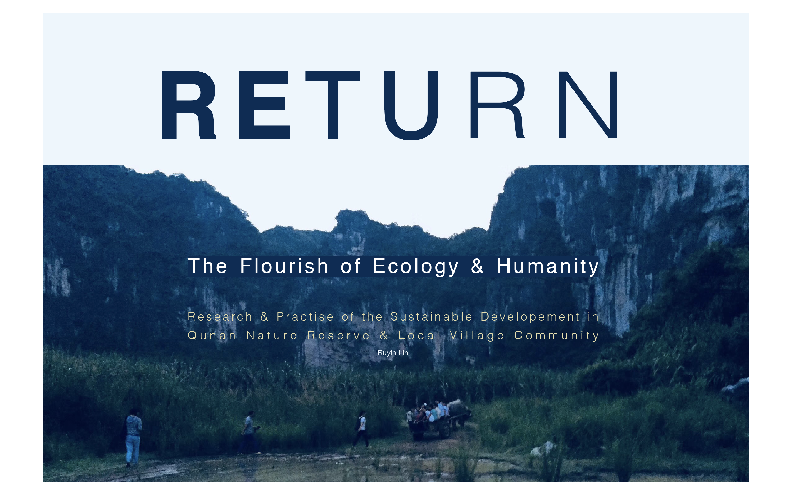
When we keep running rapidly, sometimes we should slow down and look back towards the point where we started, especially while we can see there're full of dangers ahead that feel not like what we expected before. Maybe we can think about changing our direction to correct it and question ourselves, what if our destination, is in the opposite way?

The RETURN project so far includes 3 part.
- 1.The methodology map.
- 2.The research & practice of sustainable cleaning 
- 3.A plan for application in a Chinese nature reserve and community

---

## The methodology map
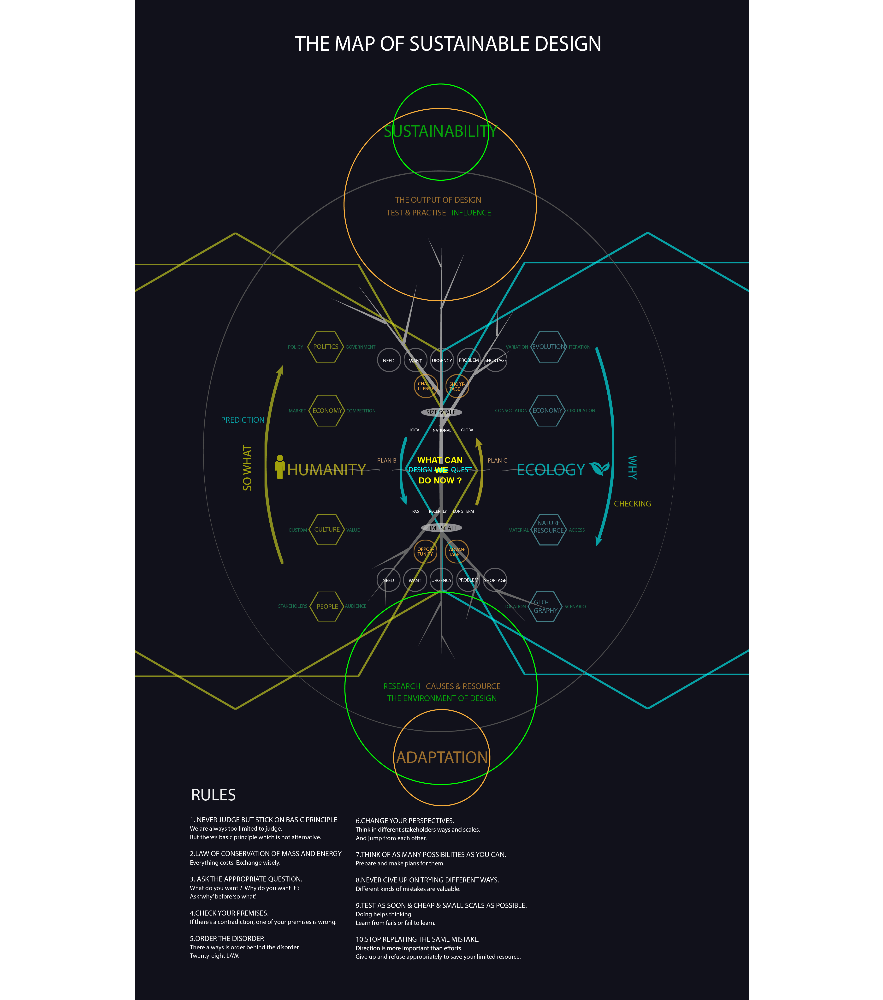
I will explain it by answering the following questions:

1. How to be sustainable?
_Plant a tree_ 

2. What do you want to sustain?
_Choose a seed_ 

3. Why flourish?
_For happiness_ 

4. How to flourish?
_Diversity & balance_ 

5. Conclusion
_Mission_ 

### 1. How to be sustainable?
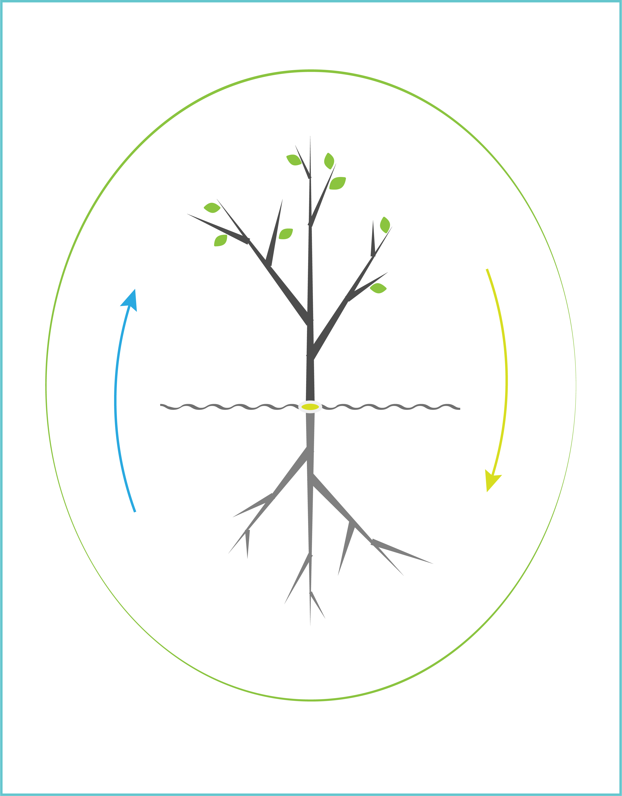
- 1.1 The Environment of Design
- 1.2 Ecology System
- 1.3 Humanity System
- 1.4 Why & So what
- 1.5 Time & Size Scales
- 1.6 Finding advantages
- 1.7 What can we do now?
- 1.8 Finding shortages
- 1.9 Testing prototypes
- 1.10 Ten rules

**1.1 The Environment of Design** 

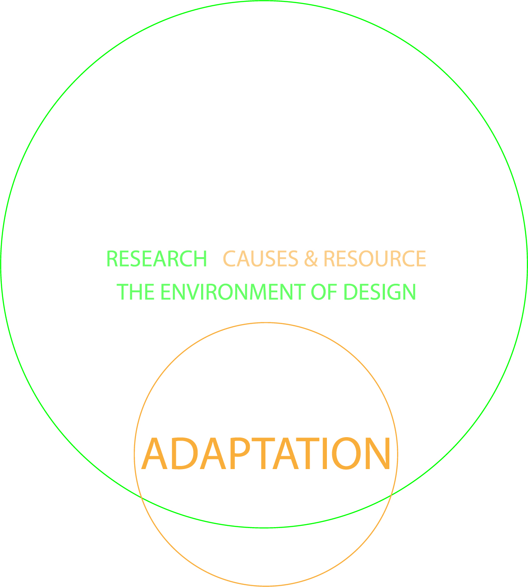

In different environments grow different kinds of trees.
Each design is run by people for the audience, at some place and some time. They're the 5W questions of design -- who, where, when, what and why. In order to let our design survive, it's worthy to spend a lot on the previous research and make decisions according to the facts and the available recourses we find, as much as we can.

**1.2 Ecology System**
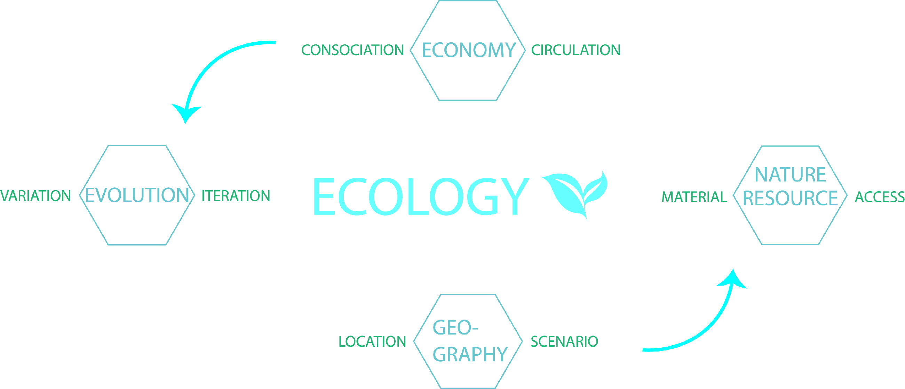

Geography decides what kinds of natural resources there are and nature will use them economically. All the systems are combined and share the materials. They run in loops to let the limited materials sustain. What's more, there're the variation and iteration to keep improving the changeable systems.
If designs exist in this physical world, they have to take some materials and turn into something for designers' reasons.

**1.3 Humanity System**
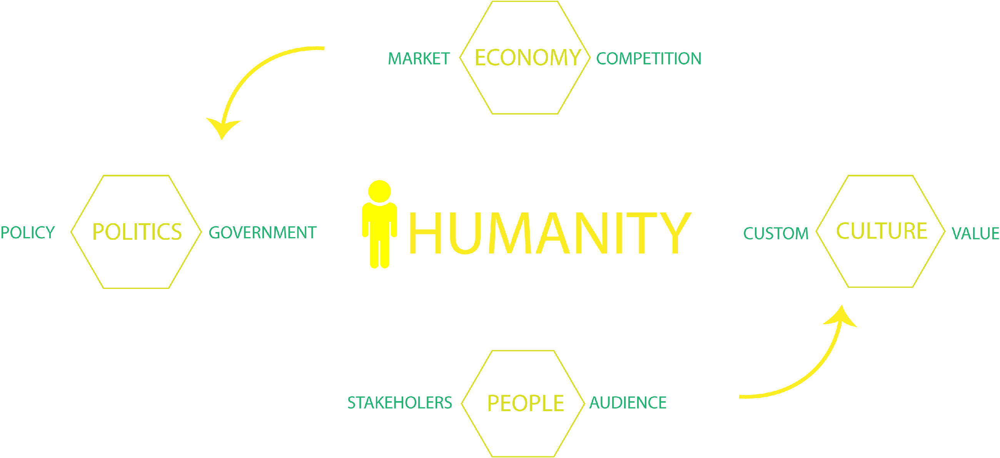

People's mind is the foundation of our system. Our bodies are born from nature so the rules of Ecology system work on us as well and there's no big difference.

In artificial designs, we work with stakeholders for our audiences whom we choose. And we make design decisions according to our values or audiences' willings from cultures. The economy is also about making decisions, for we have limited resources but endless needs and wants. So you always have to give up something for gaining something else. Competitive markets make choices for us. As Marxist said, ' Base and superstructure', politics influence our designs very much. We should know and understand the policy and search for useful resources for us. Governments are surely included in our stakeholders.

**1.4 Why & So what**
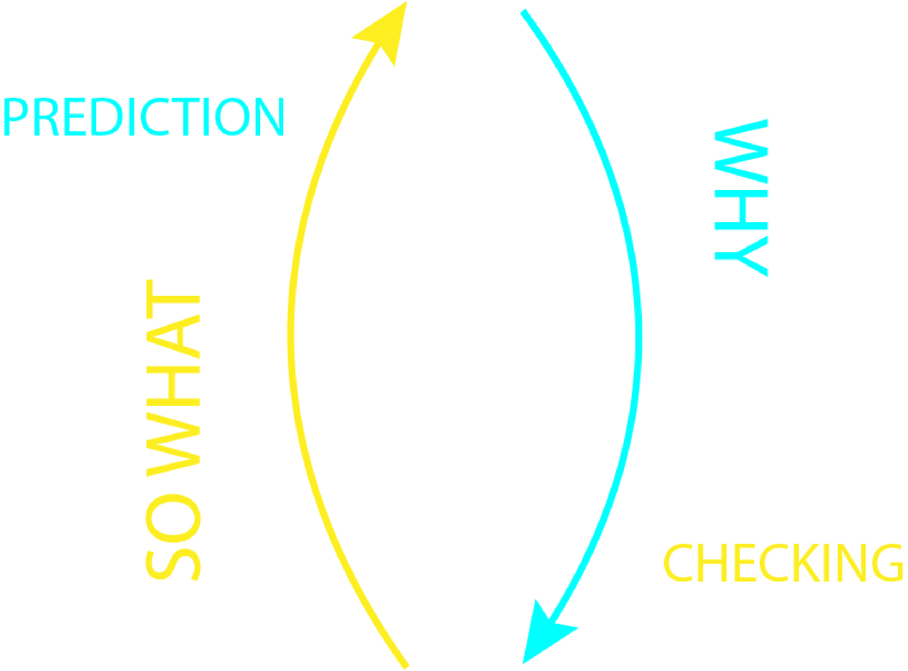

At this step, we have found pieces of facts through a large amount of work on research, but not enough. With these disordered information, we need to connect and order them by asking 'why' and 'so what'.
And asking a few times is not enough as well. It's very annoying, uncomfortable, painful and cruel, but we have to repeat the 2 questions endlessly. Because you will find every time you get different answers and it's hard to tell what are appropriate truly.
In addition, ask 'why' before 'so what'. It's very easy that we jump into designing the solution of problems instead of understanding how they were caused. Your solutions might work for a while but lose function quickly because they don't touch 'nature'. 

**1.5 Time & Size Scales**
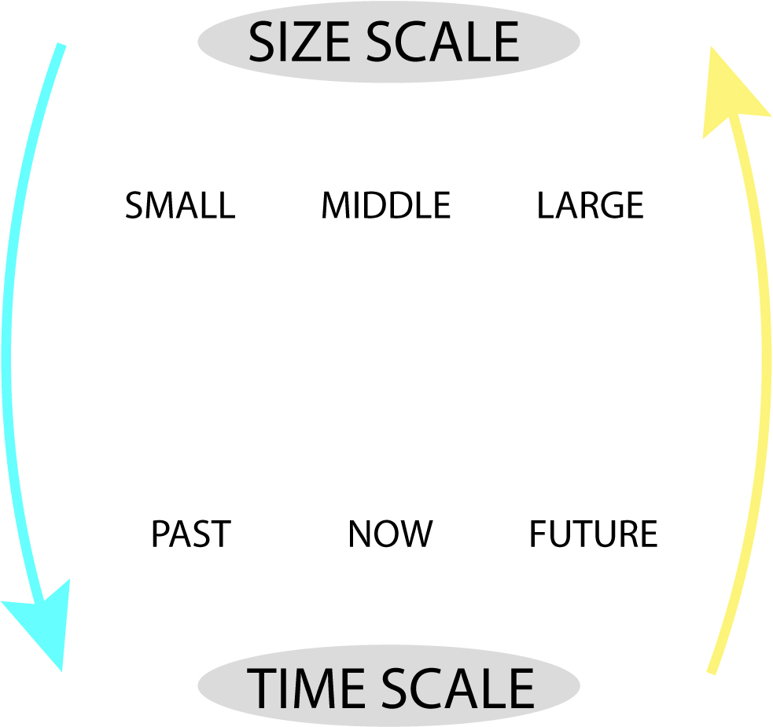
Asking in different kinds of scales of time and sizes can help us view things from all angles. 
In time, the history of the object is very important. Because things usually happen in circulations so it might already happen before. It will save us a lot if we spend enough on the previous. But the solution worked before doesn't mean it will work for now and the future. That can be our reference but of course, we can not just copy it. We usually follow the traditional ways and expect them to solve the changeable problems. 
In sizes, different scales of designs need different volumes of resource and impact with different degrees. 

**1.6 Finding advantages**
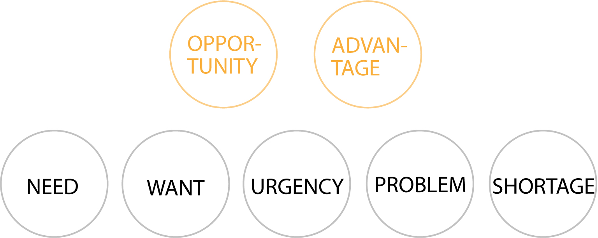
There're problems everywhere and all the time. For most situations, we can do nothing at all. It's great to realize don't try to tackle something when we don't have the ability to. Just do your part, as best as you can.
But changing small things with our limited capacity can also make a difference, especially if they're the keys.
We have to keep positive among those disappointing facts and design hopes and win-win.

**1.7 What can we do now?**
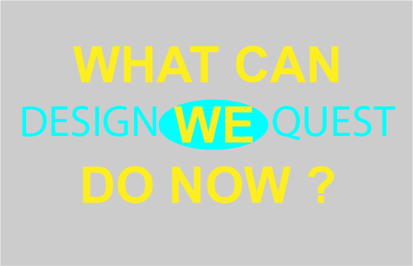

Now we can decide what we can design by answering the 5W questions after great efforts on research,finally. But as you can see, we are just at the halfway point, but it's the beginning of our influence to the world. 
Next, we need to be more brave yet careful for we're going to gain and lose physically in this material world of conservation, by action research.

**1.8 Finding shortages**
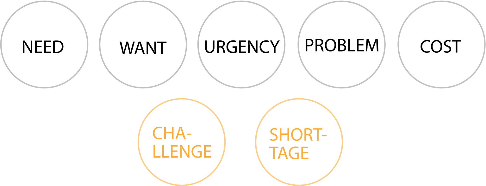
When we are very optimistic about how we are going to change the world and save the planet, it's time to hold on and reflect the challenges hiding behind the opportunities we chose. To calculate the risks, costs, and effects in different time and size scales as well as on different people. 
The reflection can protect others and us.

**1.9 Testing prototypes**
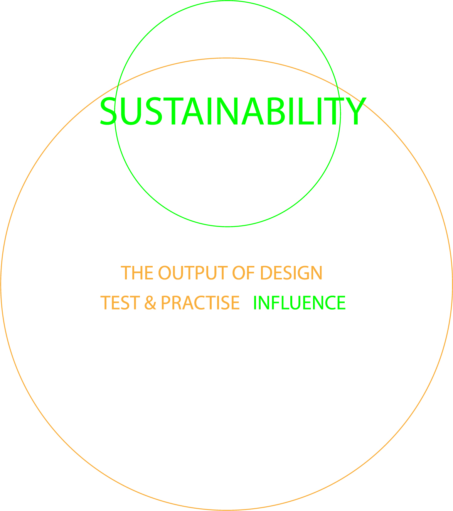
In order to make a difference, we have to take risks and pay for it, but we can make more appropriate choices after reflection ,or still can't. In case hurting others and ourselves, we can make a small step first, quickly and easily. Then to walk step by step until we can run. 
If we fall, we can have a rest to think about it and then get up again while correcting our direction from time to time by GPS, just in case you are running into the wrong way by a slight deviation in the beginning.
Only after we practicing the knowledge we learnt, we will see things are often different from our common senses and cognition. Sometimes they may prove our hard-working research is totally wrong.It is frustrating, but it doesn't mean to be meaningless. That's also an efficient way of learning.
Our designs may change completely in the future, in functions or efficiency. They can be far out of our expects when it spread furtherly.
Then we can keep questioning 'why' and 'so what' about them, and start another loop.

**1.10 Ten rules**

The 10 suggestions are also combined with each other and we need to apply them all at the same time.

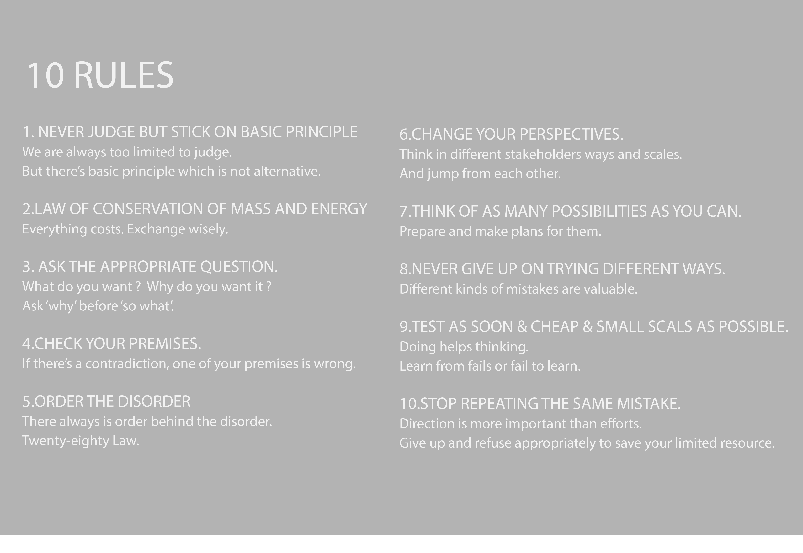

The whole process is complex, tough and cruel. Therefore nothing comes easily. 
Every existence is a unique miracle already.
Yet if we want to do something good, it's far not enough .

---

'There’s nothing new under the sun.'

The methodology already used widely everywhere. I just illustrated and explain it as a designer in my way, but everyone is a designer because we all want to sustain something. Fortune, fame, power, relationship, life….

I think the business uses it first and has done very well, especially the internet companies. That’s why they can make popular products that are so easy for users and satisfy them so much that they can not refuse them. And those designers are proud of what they have done by saying ' We create needs. That's a real innovation. '
That’s how they make money from utilizing nature and humanity. 
They built a whole enormous and cumbersome system to support it depending on the natural resource that looks like endless, exploiting loopholes and sending people to involve, by designing things that should be known invisible and educating us in their ways. 

There’s a Goebbels effect. It means when you repeat the fake thousands of times, then they become, the ‘ truth '.

In their way, things run kind of well in those systems but there's fear all the time, for it's clearly unsustainable. For it's opposite from nature's direction.
Therefore, the methodology map is just a tool and way. To use it in what directions depends on you.  

### 2. What do you want to sustain?

So the key question should be,

What do you want?

Why do you want it?

Is it really the reason for it?

Do you really benefit from it, eventually?

Are you sure the people you want to help really benefit from your designs, finally?
(Usually, we think we're doing good to others or ourselves but actually not. )

What on earth do you want?

What kind of environment do you want to adapt to?

You have to spend a lot on these questions if you really want something.
For you know, what kind of seed you plant decides what you're going to gain in the harvest. 
The destination decides the direction.
The same people will meet and help each other towards the same destination even they come from different places.

Therefore, who do you want to work with?

Where do you want to go?

### 3. Why flourish?

We always feel our behaviors are 100% reasonable and there’s nothing to doubt about ourselves.
That’s true because we do things for reasons and everything is caused by something to happen. 
So our reasons for doing things, I feel, eventually, just for, 

Happiness.

That’s what we want.
And we want it right now, very much.
So my answer to why I want to design flourish is very simple.

Because I feel happy!

And it turns out I am living happily by doing it!

I believe that's also the answer of those who are living in unsustainable ways.
We have the same answer because humanity never changes. We are all human beings. But I'm sure there's a difference between our happiness.

We have different values on what is happiness.
In my opinion, there’re 2 kinds of happiness.

One is from the brain. 

It's made by our physiological sense so that it's short, limited, feels real and we can control it by physical ways, for scientists can see it through microscopes.
So we need to eat and feels happy when eating, but if we eat too much we'll get sick. Some people keep taking drugs, shopping and searching for excitement from outside to sustain it. But we should sleep when we are sleepy instead of drinking coffee. And actually, we don't need too much sleep and food, just take what we need.

Another one is from the heart.

We feel happy when close to beautiful nature, naturally, and from the bottom of our hearts. It lasts long and limitless. For we know psychological factor always influence much more than the physical one. It feels very real as well, especially when we're heartbroken. We can also control it by getting close to or away from the truly beautiful things.

### 4. How to flourish?
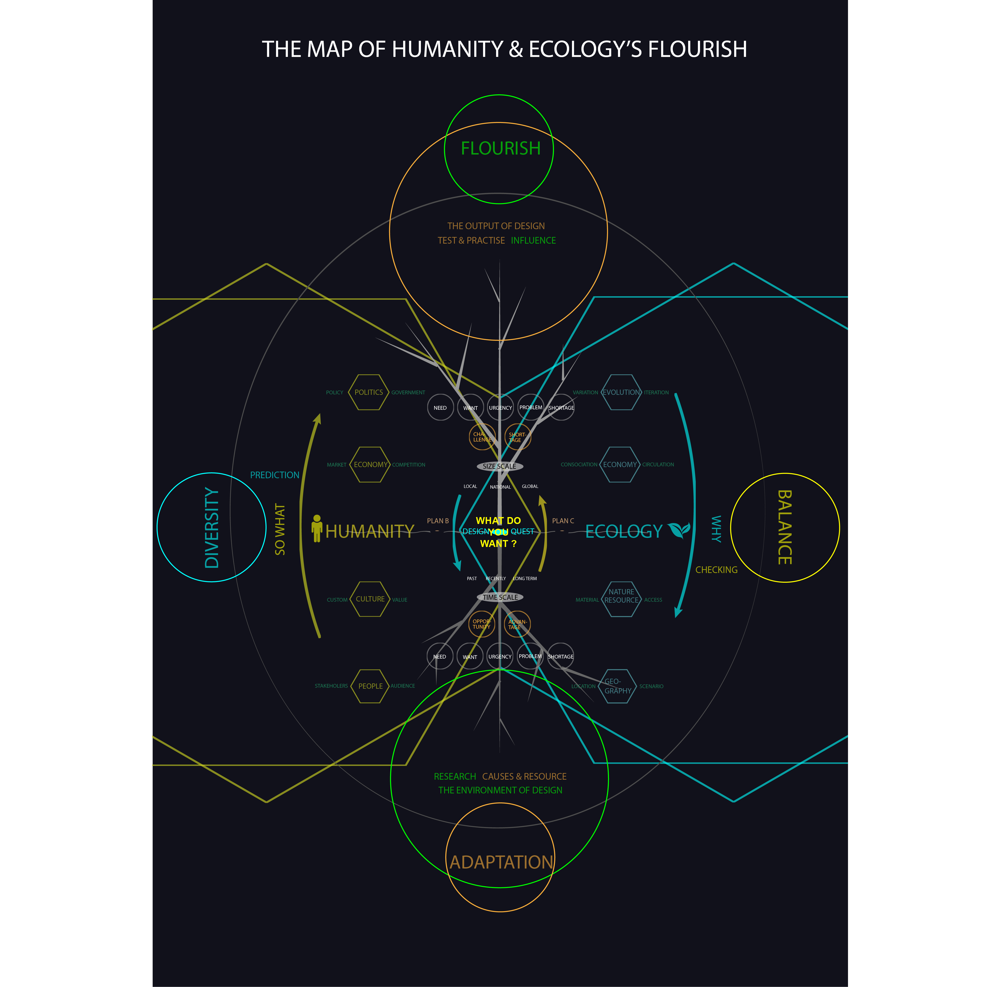

The key to be flourishing is diversity and balance.
The opposite way is singularity and lopsidedness.

To keep diversity, we should not judge the difference and unknown before we know them. In order to protect ourselves, we can keep enough distance with each other, just like sharp deers. But we can try to know and understand them by communicating and sharing instead of criticism and fight without knowledge.

In design, hearing different views, view things from different angles， thinking different possibilities, preparing different plans, work with differnt people, researching and testing in different ways, making different mistakes ... so that you can make a difference.

### 5. Conclusion

Since this class is called Sustainable Graphic Design, my conclusion about what the mission of graphic designers is ---

As visual designers, 
to visualize the invisible.

Show them,
so that people can realize.

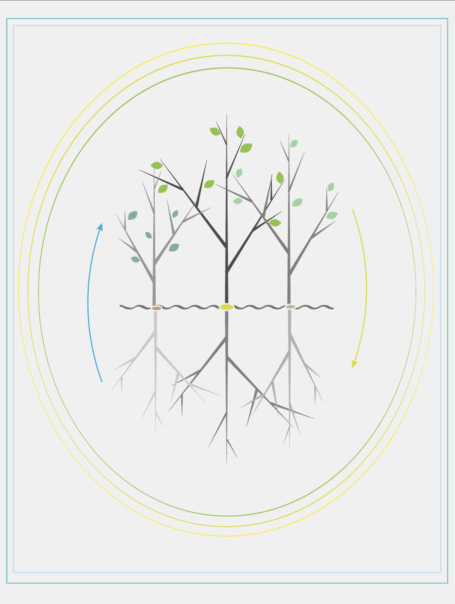

Enjoy the difficulties, if you figure out what you really want after answering all the questions and trying everything, including giving up. No one can promise that the way you choose will be easy or right, for you. 

Just imagine you're playing a game. If the game is too easy you'll lose interest. But I'm sure you will gain what you plant with your heart if you deserve it.

---
## Reference:
- [Tao Te Ching](https://www.sacred-texts.com/tao/taote.htm) — 'Tao follows the laws of Nature'.
- [Art of loving](https://en.wikipedia.org/wiki/The_Art_of_Loving) — 'Love isn't a feeling, it's a practise'.
- [<The Hitchhiker's Guide to the Galaxy>](https://www.youtube.com/watch?v=pmyNitDhMd8) — 'Ask the right question'.
- [Speculative Everything](https://readings.design/PDF/speculative-everything.pdf) — 'The advantage of designers is to visual things after logical thingking'.
- [double-diamond](https://www.thoughtworks.com/insights/blog/double-diamond) — 'The Design Process'.
- [six thinking hats](http://www.debonogroup.com/six_thinking_hats.php) — 'Viewing the problem from all angles'.
- [Scale](https://www.youtube.com/watch?v=XyCY6mjWOPc) — 'The Universal Laws of Growth, Innovation, Sustainability, and the Pace of Life in Organisms, Cities, Economies, and Companies'.
- [Antifragile](https://en.wikipedia.org/wiki/Antifragile) — 'Things That Gain From Disorder '.
- [Positive Psychology](https://www.youtube.com/watch?v=K8qpn6kNfPc&list=PL28D16304BA57DD7E) — 'Learn from fails or fail to learn'.
- [Atlas Shrugged](https://en.wikipedia.org/wiki/Atlas_Shrugged) — 'Check your premises'.

